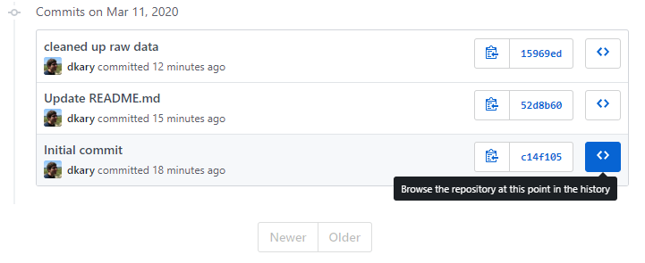

# lunchtime-learning
A brief Github demo, with some resources highlighted below.

## Resources
- [Github](https://github.com/)
- [Github Desktop](https://desktop.github.com/)
- [Markdown Cheatsheet](https://github.com/adam-p/markdown-here/wiki/Markdown-Cheatsheet#images). See [Typora](https://typora.io/) for a nice markdown editor.

## Markdown Links
It's easy to make links to websites or files within your repo:

[web link](https://github.com/)
[file link](data/raw/input.xlsx)

## Repository Commits (Snapshots)
You can look at different snapshots in time by clicking "commits". This allows you full access to the files at each snapshot:

Using markdown, I can also easily include images by linking to the file with ``